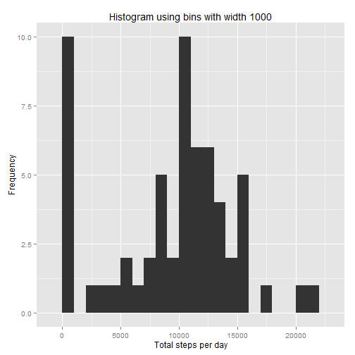
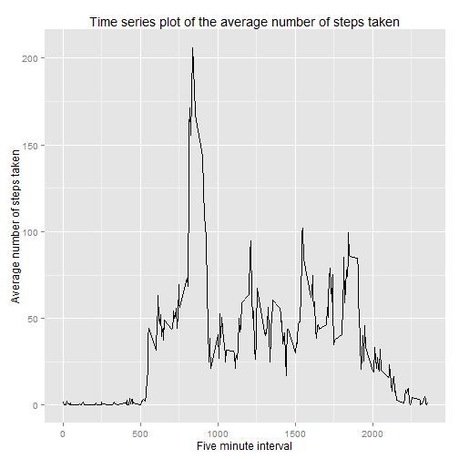
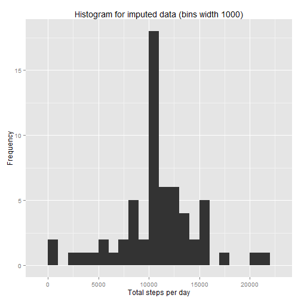
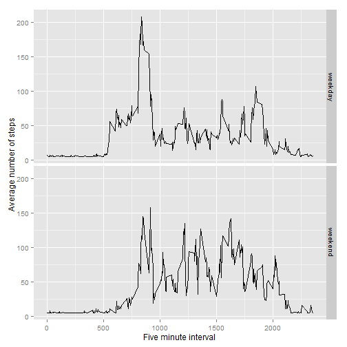

# Reproducible Research: Peer Assessment 

Load the packages we will use for this assignment.


```r
library(ggplot2)
library(scales)
library(Hmisc)
```

## Loading and preprocessing the data

We assume that the zip file is downloaded and saved as activity.zip at the R working directory, i.e. at the directory that is obtained as output of `getwd()`.


```r
if(!file.exists('activity.csv')){
  unzip(zipfile = "activity.zip")    
}
activityData <- read.csv("activity.csv", colClasses = c("numeric", "character", "numeric"))

activityData$date <- as.Date(activityData$date, "%Y-%m-%d")
```

## What is mean total number of steps taken per day?

First, we calculate the total number of steps per day.
Second, we create a histogram of the total number of steps taken each day
Finally, we calculate and report the mean and median of the total number of steps taken per day.

We ignore the missing values in the dataset for the steps given above.


```r
stepsPerDay <- tapply(activityData$steps, activityData$date, FUN=sum, na.rm=TRUE)
qplot(stepsPerDay, binwidth=1000, main='Histogram using bins with width 1000', xlab='Total steps per day', ylab='Frequency')
```

 

```r
mean(stepsPerDay)
```

```
## [1] 9354.23
```

```r
median(stepsPerDay)
```

```
## [1] 10395
```

## What is the average daily activity pattern?

First, we make a time series plot of the average number of steps taken, averaged across all days (y-axis) for the 5-minute interval (x-axis). Then we determine which
5-minute interval, on average across all the days in the dataset, contains the maximum number of steps.


```r
averageSteps <- aggregate(x=list(steps=activityData$steps), by=list(interval=activityData$interval), FUN=mean, na.rm=TRUE)

# Time-series plot

ggplot(data=averageSteps, aes(x=interval, y=steps)) + geom_line() + xlab("Five minute interval") + 
  ylab("Average number of steps taken") + ggtitle("Time series plot of the average number of steps taken")
```

 

```r
# 5-minute interval with the maximum number of steps

maxNumberSteps <- which.max(averageSteps$steps)
intervalWithMaxNumberSteps <-  gsub("([0-9]{1,2})([0-9]{2})", "\\1:\\2", averageSteps[maxNumberSteps,'interval'])
```
The most steps are made at the 8:35 time interval.

## Imputing missing values

There are some days and/or intervals where there are missing values (coded as `NA`). 


```r
missingValues <- length(which(is.na(activityData$steps)))
```
The total number of missing values is 2304.

We use the mean for the 5-minute interval to fill in for the missing values, and we create a new data set,
imputedActivityData, which is equal to the original dataset but with the missing data filled in.

```r
# Replace each missing value with the mean value of its 5-minute interval
imputedActivityData <- activityData
imputedActivityData$steps <- impute(activityData$steps, fun=mean)
```
We use imputed activity data set to make a histogram of the total number of steps taken each day and to 
calculate and report the mean and median total number of steps taken per day.


```r
imputedStepsPerDay <- tapply(imputedActivityData$steps, imputedActivityData$date, sum)
qplot(imputedStepsPerDay, binwidth=1000, main='Histogram for imputed data (bins width 1000)', xlab='Total steps per day', ylab='Frequency')
```

 

```r
meanStepsPerDay <- mean(imputedStepsPerDay)
medianStepsPerDay <- median(imputedStepsPerDay)
```
After replacing the missing values with mean of the 5-minute interval, we get the mean 
1.0766189 &times; 10<sup>4</sup> and median 1.0766189 &times; 10<sup>4</sup>. It is obvious that  mean and median values are higher after imputing missing data. This is due to the fact that missing values (i.e. the number of steps) in original data set, without imputing, are by default replaced by zero. The imputed data set replaces missing values with numbers that are non-negative, hence the higher values for mean and median.

## Are there differences in activity patterns between weekdays and weekends?
First, let's find the day of the week for each measurement in the dataset. In
this part, we use the imputed dataset.


```r
weekday.or.weekend <- function(date) {
    day <- weekdays(date)
    if (day %in% c("Monday", "Tuesday", "Wednesday", "Thursday", "Friday"))
        return("weekday")
    else if (day %in% c("Saturday", "Sunday"))
        return("weekend")
    else
        stop("Incorrect day value")
}
imputedActivityData$date <- as.Date(imputedActivityData$date)
imputedActivityData$day <- sapply(imputedActivityData$date, FUN=weekday.or.weekend)
```

Next we create a panel plot containing plots of average number of steps taken on weekdays and weekends. From the plot we can say that the variance of the average number of steps during the weekday is higher than the variance of average number of steps during the weekend. In other words, the number of steps during the weekend in five minute intervals is more flattened.

```r
averages <- aggregate(steps ~ interval + day, data=imputedActivityData, mean)
ggplot(averages, aes(interval, steps)) + geom_line() + facet_grid(day ~ .) +
    xlab("Five minute interval") + ylab("Average number of steps")
```

 
